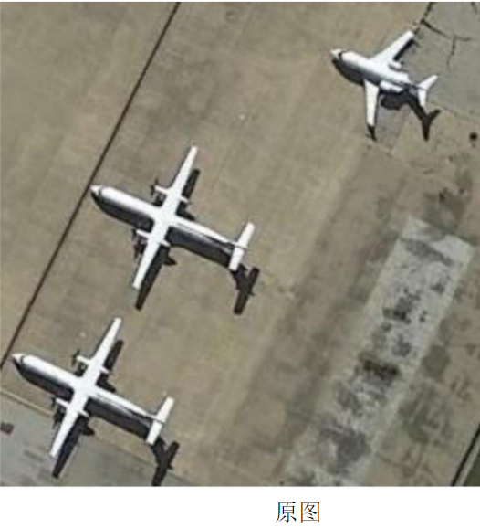
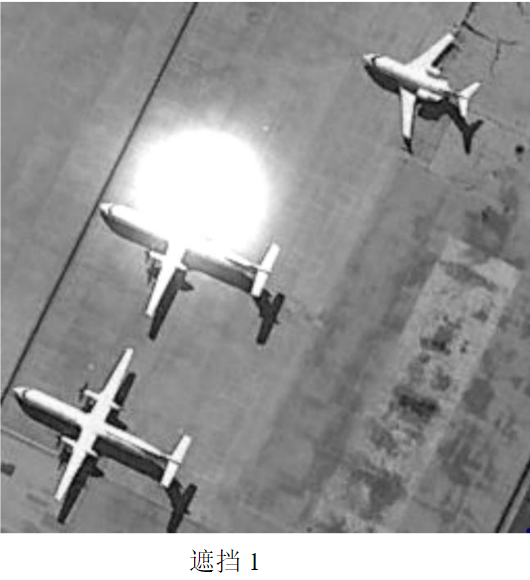
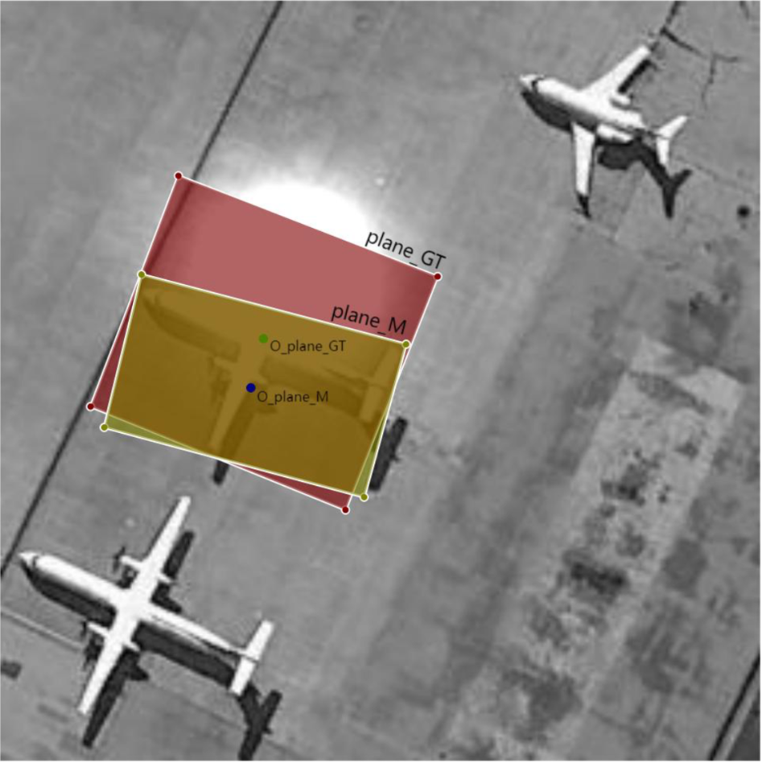

# 《模式识别与机器学习》课程设计

<details><summary>课程设计要求、项目详情、考核与报告规范 (点击展开/折叠)</summary>

## 一、课程设计概述

### 1.1 课程目的

《模式识别与机器学习》课程设计作为独立的教学环节，是模式识别与智能系统专业集中实践性环节系列之一，是学习完《模式识别》、《模式识别与机器学习》课程后进行的一次全面的综合练习。其目的在于加深对模式识别与机器学习基础理论和基本知识的理解，掌握使用特征分析、特征提取及模式辨识的基本方法，提高解决实际问题、开发图像自动识别系统的实践能力。同时课程设计应充分体现"教师指导下的以学生为中心"的教学模式，以学生为认知主体，充分调动学生的积极性和能动性，重视学生自学能力的培养。

### 1.2 总体设计要求

模式识别课程设计由于涉及到的内容较多，工作量大，根据课程本身的特点，特提出如下要求：

1.  课程设计需要在课程内容讲完后给学生布置，让学生结合课堂讲授内容，并在教师的具体指导下，逐步开始分析工作。
2.  学生开展课程设计按 5 人一组进行分组，并确定一个组长，明确组员分工与协调。
3.  各组在分工的前提下制定相应的任务完成计划，并按计划开展课程设计，接受教师检查。
4.  课程设计的题目的选择可根据学生的自身理论学习体会和研究兴趣，结合实际或熟悉的课题，体现"麻雀虽小、五脏俱全"，充分练习模式识别的各个方面的内容。
5.  课程设计必须完成对模式识别与机器学习处理系统的分析与设计任务，编写相应的分析与设计报告。实施部分的内容可根据小组的实际能力决定取舍。

### 1.3 课程具体步骤与时间安排

本课程设计历时 10 周，学分 2 分。

具体步骤安排如下：

1.  课题选取，选取 1 个题目，并进行系统调研、资料整理。
2.  收集、整理、学习与设计相关的技术资料。
3.  进行相关选题的特征分析/模式分析，研究并设计实现任务的算法。可以参考复现文献中别人的研究成果，如能提出自己的见解和改进则更好。
4.  算法程序的设计和调试。
5.  按照进度对数据库数据进行实验，认真进行设计相关内容的记录,试验结果分析。试验结果如不能满足课题要求,需进行试验设计调整或算法调整,再次试验,直至试验结果满足课题要求,或进行不同算法试验结果比对与分析。
6.  完成课程设计报告。这是出成果的阶段，要认真整理前面各阶段的成果，包括完整的研究过程，实验中的失败与经验教训等，可以一一誊写在设计报告中。报告要求文字通顺、计算准确、画图清晰整洁。注意按统一规定格式和封面，打印、装订成册。工作量大、时间紧，需要付出一定的辛苦。

时间安排及方式(每 5 人一组)：

1.  课程设计任务书的布置，讲解（0.5 天）
2.  学生根据任务书的要求初步进行需求分析（第 7-8 周）
3.  进行方案设计，并撰写设计方案（第 9-10 周）
4.  指导老师审阅方案设计报告，根据意见修改设计方案（第 11 周）
5.  算法设计与实现（第 12-13 周）
6.  软件实现与算法测试（第 14-15 周）
7.  撰写课程设计报告（第 16 周）
8.  考核答辩（第 17 周）

## 二、课程设计项目：遮挡条件下遥感图像中的飞机目标检测

### 2.1 项目选题

我们的题目：遮挡条件下遥感图像中的飞机目标检测

### 2.2 任务描述

用高斯光斑模拟遥感图像中的飞机目标的部分遮挡场景，构建遮挡场景测试数据集，完成遮挡条件下遥感图像中飞机目标的自动检测，并给出目标中心（以原始无遮挡数据集中目标斜框中心为参考标注）。分析遮挡程度（可自行设计遮挡尺度指标）、目标尺度等因素对目标检测结果的影响。

自动检测，标记出其具体区域。注意检测结果采用倾斜目标范围框(回归)的方法，如下图所示。


原图


遮挡 1


检测结果

遮挡条件下飞机目标检测结果示意图

### 2.3 数据说明

无遮挡原始数据集采用 DOTA 数据集，选取其中飞机目标进行实验，数据集下载地址：[http://captain.whu.edu.cn/DOTAweb/](http://captain.whu.edu.cn/DOTAweb/)。

### 2.4 参考文献

[1] You Only Look Twice — Multi-Scale Object Detection in Satellite Imagery With Convolutional Neural Networks (Part I), Adam Van Etten, 2017.
[2] Lin Na, Feng Lirong, Zhang Xiaoqing. Aircraft Detection in Remote Sensing Image based on Optimized Faster-RCNN. Remote Sensing Technology and Application [J], 2021, 36(2): 275-284 doi:10.11873/j.issn.1004-0323.2021.2.0275
[3] Gui-Song Xia, Xiang Bai, Jian Ding, Zhen Zhu, Serge Belongie, Jiebo Luo, Mihai Datcu, Marcello Pelillo, and Liangpei Zhang. Dota: A largescale dataset for object detection in aerial images. In Proceedings of the IEEE conference on computer vision and pattern recognition, pages 3974–3983, 2018

### 2.5 指导老师

胡静, by6040130@163.com，qq：413953381

## 三、课程设计的考查

### 3.1 考核方式

由平时检查和结题答辩时的提问抽查、现场演示、课题难易程度和工作量饱满程度，以及设计报告撰写情况等几方面综合起来考虑。具体包括学习与设计态度的认真性，课堂知识理解掌握的深入程度，常用工具软件应用的熟练程度，设计方案的正确性或合理性，图文的质量效果，是否独立完成，是否具有独立分析解决问题的能力和创新精神等。

### 3.2 成绩评定

课程设计成绩的评价依据 = 工作量（15%）+个人工作表现（10%）+创新性（20%）+实验与分析（35%）+报告写作（10%）+报告答辩及成果展示（10%）。

| 评分内容     | 综合表现     | 设计报告     | 答辩         |
| ------------ | ------------ | ------------ | ------------ |
|              | 工作量       | 个人工作表现 | 创新性       |
|              | 实验与分析   | 报告写作     | 报告答辩及成果展示 |
| **评价比重** | **0.15**     | **0.10**     | **0.20**     |
|              | **0.35**     | **0.10**     | **0.10**     |

\*切记要独立完成，不得抄袭他人成果。一旦发现抄袭者，课程成绩一律按不及格处理。

课程设计成绩：按答辩时的评审老师评分平均值计算，采用百分制评定。95-100 为优秀，90-94 为良好，70-89 为中等，60-69 为及格，低于 60 分的为不及格。

-   **优秀**：能独立完成设计要求所规定的全部内容，设计方案正确、基本概念清楚，有独到的见解或创造性，与当前主流研究成果相比较效果更优异。每个组员的工作量饱满，贡献突出。
-   **良好**：能较好完成设计要求所规定的全部内容，设计方案正确，分析问题正确、基本概念清楚，运用多种当前主流技术和算法进行了任务实验、性能对比和深入分析。
-   **中等**：能完成设计要求规定的全部内容，设计方案基本正确，基本概念清楚。
-   **及格**：基本完成设计要求规定的内容，设计方案基本合理，基本概念较清楚。
-   **不及格**：未完成设计要求规定的内容，设计方案不合理，或有较严重缺陷，基本概念不清楚。

## 四、课程设计报告撰写要求

课程设计说明书是课程设计工作的总结，它应该反映出学生在课程设计过程中所做的主要工作和取得的主要成果。学生必须以积极认真、严谨求实的态度完成课程设计说明书的撰写。

课程设计说明书写作的具体内容包括：

### 4.1 封面

包括题目，指导老师，组员信息（姓名，学号，班级，每个人的工作占比）

### 4.2 摘要

要求写出同一内容的中文和英文的摘要。摘要应说明本设计的中心思想和主要内容，突出设计中的新见解新方法，说明该设计方案的理论根据及现实意义。摘要力求简明扼要，字数为 300 字左右。

### 4.3 目录

目录是整个设计的提纲，也是设计的重要组成部分，它方便评阅教师了解设计的整体结构。目录以章、节两级目录为宜。

### 4.4 正文

课程设计说明书的正文一般可按章、节的格式来书写，正文常常包括如下几个部分：

1.  **第一章 课题概述**
简要介绍所选课题现行研究现状、存在的主要问题，说明选题的意义及必要性。
2.  **第二章 算法分析**
    *   2.1 需求分析
    *   2.2 研究方案设计
    *   2.3 试验算法选择与分析（或算法设计）
    *   2.4 特征提取算法研究（可选）
    *   2.5 特征分析算法研究（可选）
    *   2.6 模式分类/识别算法研究（可选）
3.  **第三章 试验系统设计** (包含程序流程图、程序功能介绍)
    *   3.1 系统总体结构设计
    *   3.2 代码设计
    *   3.3 输入/输出设计
    *   3.4 模块功能与处理过程设计
4.  **第四章 软件实施与实验运行**
    *   4.1 软件系统实施（编程、调试、运行）
    *   4.2 数据库测试
    *   4.3 试验结果与分析
5.  **第五章 结束语**
研究结论,通过课程设计对模式识别学科的认识与体会,每人的工作划分。

### 4.5 附录

主要模块代码（注释代码比例不得低于 1：1）

### 4.6 参考文献

（不少于 6 篇）

以上内容供学生编写设计说明书时参考，学生可根据实际系统开发情况及指导教师的具体要求进行内容的增删或章节的调整。

## 五、答辩评分表（2025 版）

**华中科技大学《模式识别与机器学习课程设计》**

学生姓名： \_\_\_\_\_\_\_\_\_\_ 学号： \_\_\_\_\_\_\_\_\_\_ 工作占比： \_\_\_\_\_\_\_\_\_\_ 时间： \_\_\_\_\_\_\_\_\_\_

选题：（指导书序号+题名）\_\_\_\_\_\_\_\_\_\_\_\_\_\_\_\_\_\_\_\_\_\_\_\_\_\_\_\_\_\_\_\_\_\_\_\_\_\_\_\_\_\_\_\_\_\_\_

| 评价指标       | 评价要素                                                                                              | 分项评价（请打"√"）             |
| -------------- | ----------------------------------------------------------------------------------------------------- | -------------------------------- |
|                |                                                                                                       | 优     | 良     | 一般   | 较差   |
| 工作量         | 工作量饱满。                                                                                            |        |        |        |        |
| 个人工作表现   | 完成主要设计内容，设计工作参与度高，对小组集体工作贡献大。                                                |        |        |        |        |
| 创新性         | 研究成果有独到的见解和创新性。                                                                          |        |        |        |        |
| 实验与分析     | 实验充分；选择比对算法和方法充分考虑了国内外最新研究成果；实验结果真实可行；性能有相对性提高。            |        |        |        |        |
| 报告写作       | 概念正确，条理清晰，文笔流畅，格式规范，学风严谨；表达准确，语句通顺，语法正确。                            |        |        |        |        |
| 报告答辩       | 能流利、清晰地汇报设计报告的主要内容；能准确回答问题。                                                      |        |        |        |        |
| 成果展示       | PPT 制作美观大方，逻辑清晰，思路明确；答辩时成果展示充分，结果真实可信。                                    |        |        |        |        |
| **总体评价**   | 请在右侧栏内给出百分制总评成绩（100-90 为优秀；89-80 为良好；79-60 为一般；60 分以下不合格）               |                                  |
| 评审老师签名   |                                                                                                       |                                  |

</details>

## 六、项目任务分解与时间规划 (To-Do List)

**项目核心：** 遮挡条件下遥感图像中的飞机目标检测 (使用高斯光斑模拟遮挡, DOTA数据集, 倾斜目标框回归)

**团队规模：** 5人 (组长进行协调和进度管理)

---

### **项目任务分解与时间规划 (To-Do List)**

#### **第一阶段：课题调研与方案设计 (第7周 - 第10周)**

**第7-8周：需求分析与初步调研**

*   **任务1：深入理解项目需求 (全体成员)**
    *   [x] 仔细阅读课程设计任务书，明确目标、任务描述、数据说明和考核标准。(相关指南请参考：[Git、GitHub操作与团队协作指南](#七gitgithub操作与团队协作指南))
    *   [ ] 小组讨论，确保每位成员对项目有统一和清晰的理解。
*   **任务2：文献调研与技术选型 (分工合作)**
    *   [ ] **成员A&B**: 调研 DOTA 数据集特性，飞机目标的特点，现有遥感图像目标检测方法。
    *   [ ] **成员C&D**: 调研 Faster R-CNN 及其优化算法，特别是针对小目标和旋转目标的改进。
    *   [ ] **成员E**: 调研图像遮挡模拟方法（尤其是高斯光斑），以及遮挡对目标检测影响的研究。
    *   [ ] **全体成员**: 收集至少6篇高质量参考文献，重点关注项目提及的文献。
*   **任务3：数据准备与熟悉 (成员A&B)**
    *   [ ] 下载DOTA数据集。
    *   [ ] 筛选出飞机目标子集，熟悉数据格式和标注。
*   **任务4：初步方案构思与讨论 (全体成员)**
    *   [ ] 讨论如何构建高斯光斑遮挡场景。
    *   [ ] 讨论如何设计遮挡程度的衡量指标。
    *   [ ] 初步确定核心检测算法选型。
    *   [ ] 讨论倾斜目标框的回归方法。
*   **任务5：制定详细工作计划与分工 (组长协调，全体确认)**
    *   [ ] 明确每个阶段的交付物。
    *   [ ] 细化每个成员的具体职责。

**第9-10周：方案设计与报告撰写**

*   **任务6：详细算法设计 (分工合作)**
    *   [ ] **成员C**: 设计高斯光斑生成算法，用于模拟不同程度的遮挡。
    *   [ ] **成员A**: 设计遮挡程度的量化指标。
    *   [ ] **成员D&E**: 详细设计基于所选框架（如Faster R-CNN）的飞机目标检测算法，包括网络结构、损失函数、倾斜框回归策略。
    *   [ ] **成员B**: 设计实验方案，如何分析遮挡程度、目标尺度对检测结果的影响。
*   **任务7：系统架构设计 (全体成员)**
    *   [ ] 绘制系统总体流程图。
    *   [ ] 确定各模块接口。
*   **任务8：撰写设计方案报告初稿 (分工撰写，组长汇总)**
    *   [ ] 章节1: 课题概述 (研究现状、意义) - **成员A**
    *   [ ] 章节2: 算法分析 (需求分析、研究方案、算法选择与分析) - **成员B&C**
    *   [ ] 章节3: 试验系统设计 (总体结构、模块功能) - **成员D&E**
    *   [ ] 全体成员：审核并完善初稿。

#### **第二阶段：方案评审与算法实现 (第11周 - 第13周)**

**第11周：方案评审与修改**

*   **任务9：提交设计方案报告 (组长)**
    *   [ ] 按时提交给指导老师。
*   **任务10：根据指导老师意见修改方案 (全体成员)**
    *   [ ] 认真记录反馈意见。
    *   [ ] 针对性修改和完善设计方案。

**第12-13周：算法设计与实现**

*   **任务11：开发环境搭建 (成员D或E，其他成员配合)**
    *   [ ] 配置深度学习框架 (PyTorch/TensorFlow)。
    *   [ ] 安装必要的库 (OpenCV, NumPy, etc.)。
    *   [ ] 建立代码仓库 (如Git)。
*   **任务12：核心模块编码实现 (分工合作)**
    *   [ ] **数据预处理模块 (成员A)**
        *   [ ] DOTA飞机数据加载与解析。
        *   [ ] 图像预处理 (裁剪、缩放、归一化等)。
    *   [ ] **高斯遮挡生成模块 (成员C)**
        *   [ ] 实现高斯光斑生成函数。
        *   [ ] 实现将光斑应用到图像指定区域的函数。
    *   [ ] **飞机目标检测模型 (成员D&E)**
        *   [ ] 基于选定框架搭建网络模型。
        *   [ ] 实现倾斜目标框的预测和回归。
        *   [ ] 实现模型训练代码。
    *   [ ] **遮挡程度计算模块 (成员B)**
        *   [ ] 实现设计的遮挡程度量化指标。
*   **任务13：单元测试 (各模块负责人)**
    *   [ ] 对各自实现的模块进行充分的单元测试，确保功能正确。

#### **第三阶段：软件实现与测试 (第14周 - 第15周)**

**第14-15周：软件实现与算法测试**

*   **任务14：系统集成与联调 (全体成员)**
    *   [ ] 将各模块集成为一个完整的检测系统。
    *   [ ] 解决集成过程中出现的接口和逻辑问题。
*   **任务15：构建遮挡测试数据集 (成员A&C)**
    *   [ ] 利用高斯遮挡模块，在原始飞机数据上生成不同遮挡程度、不同目标尺度的测试样本。
    *   [ ] 确保测试集的多样性和代表性。
*   **任务16：模型训练与调优 (成员D&E，其他成员协助分析)**
    *   [ ] 在无遮挡原始数据集上预训练模型。
    *   [ ] （可选）在混合了遮挡数据的数据集上进行训练或微调。
    *   [ ] 调整超参数，优化模型性能。
*   **任务17：综合实验与结果分析 (全体成员，各有侧重)**
    *   [ ] **成员B&C**: 在构建的遮挡测试集上进行实验，记录检测结果。
    *   [ ] **成员A**: 分析遮挡程度对检测准确率、召回率、倾斜框精度等指标的影响。
    *   [ ] **成员D&E**: 分析目标尺度对检测结果的影响。
    *   [ ] **全体成员**: 对比不同算法或参数设置下的实验结果（如果时间允许）。
    *   [ ] 记录实验过程中的问题、解决方法和经验教训。
*   **任务18：代码整理与注释 (全体成员)**
    *   [ ] 确保代码规范，注释清晰，注释比例不低于1:1。

#### **第四阶段：报告撰写与答辩准备 (第16周 - 第17周)**

**第16周：撰写课程设计报告**

*   **任务19：完成课程设计报告终稿 (分工合作，组长统稿)**
    *   [ ] **封面、摘要、目录 (组长)**
    *   [ ] **第一章 课题概述 (成员A)** - 更新研究现状，明确项目意义。
    *   [ ] **第二章 算法分析 (成员B&C)** - 完善算法选择理由，详细描述设计的遮挡和检测算法。
    *   [ ] **第三章 试验系统设计 (成员D&E)** - 详细描述系统架构、程序流程图、各模块功能和代码设计思路。
    *   [ ] **第四章 软件实施与实验运行 (全体成员)** - 详细记录软件实现过程、数据库测试、详尽的实验结果与深入分析 (图表结合)。
    *   [ ] **第五章 结束语 (组长，全体讨论)** - 总结研究结论，课程设计体会，明确每人工作划分和贡献。
    *   [ ] **附录 (各模块开发者)** - 附上主要模块的核心代码及注释。
    *   [ ] **参考文献 (全体成员)** - 整理并规范参考文献格式。
    *   [ ] **全体成员**: 交叉审阅报告，确保文字通顺、数据准确、图表清晰、格式规范。

**第17周：考核答辩**

*   **任务20：准备答辩PPT (分工合作，组长整合)**
    *   [ ] 内容应包括：项目背景、研究目标、方案设计、算法实现、实验结果与分析、结论与展望、个人贡献。
    *   [ ] PPT制作美观大方，逻辑清晰。
*   **任务21：准备成果演示 (负责编码和测试的成员)**
    *   [ ] 准备好可运行的检测系统和典型的测试样例。
    *   [ ] 确保演示流畅。
*   **任务22：答辩演练 (全体成员)**
    *   [ ] 模拟答辩场景，互相提问，熟悉答辩流程。
    *   [ ] 准备应对可能被问到的问题。
*   **任务23：参加答辩 (全体成员)**

---

**通用任务 (贯穿项目始终):**

*   [ ] 定期小组会议，同步进度，讨论问题。
*   [ ] 做好详细的会议记录和决策记录。
*   [ ] 积极与指导老师沟通，及时反馈问题并寻求指导。
*   [ ] 保证工作量饱满，积极参与，独立思考。
*   [ ] **切记独立完成，杜绝抄袭！**

## 七、Git、GitHub操作与团队协作指南
<details><summary>Git、GitHub操作与团队协作指南 (点击展开/折叠)</summary>

### 一、常用 Git 操作详解

1.  **克隆仓库 (Cloning)**
    *   **目的**: 当团队其他成员需要获取项目代码时，他们需要克隆远程 GitHub 仓库到自己的本地电脑。
    *   **命令**: `git clone <repository_url>`
        *   例如: `git clone https://github.com/tomtimo0/RS_Aircraft_Occlusion_Detection.git`
    *   **说明**: 这会在当前目录下创建一个与远程仓库同名的文件夹，并包含所有项目文件和版本历史。

2.  **查看状态 (Checking Status)**
    *   **目的**: 了解当前工作区文件的状态（哪些文件被修改了、哪些文件已暂存等）。
    *   **命令**: `git status`
    *   **说明**: 这是最常用的命令之一，建议在执行 `add`、`commit` 前都运行一下。

3.  **创建与切换分支 (Branching)**
    *   **目的**: 为了并行开发不同功能或修复 bug，而不影响主分支 (`main`) 的稳定性。每个新功能、修复都应该在新的分支上进行。
    *   **创建新分支并切换过去**: `git checkout -b <branch_name>`
        *   例如: `git checkout -b feature/data-preprocessing` 或 `git checkout -b fix/readme-typo`
    *   **切换到已存在的分支**: `git checkout <branch_name>`
    *   **查看所有本地分支**: `git branch`
    *   **查看所有远程分支**: `git branch -r`
    *   **查看所有本地和远程分支**: `git branch -a`
    *   **删除本地分支 (谨慎操作)**: `git branch -d <branch_name>` (如果已合并) 或 `git branch -D <branch_name>` (强制删除)

4.  **暂存更改 (Staging Changes)**
    *   **目的**: 将工作目录中已修改或新增的文件添加到 Git 的暂存区，准备进行提交。
    *   **暂存特定文件**: `git add <file_name>`
        *   例如: `git add README.md`
    *   **暂存特定文件夹下的所有更改**: `git add <folder_name>/`
    *   **暂存当前目录下所有更改 (包括新增、修改、删除)**: `git add .` (常用) 或 `git add -A`

5.  **提交更改 (Committing Changes)**
    *   **目的**: 将暂存区的内容永久保存到本地仓库的版本历史中。
    *   **命令**: `git commit -m "Your descriptive commit message"`
        *   例如: `git commit -m "Feat: Implement Gaussian blur for occlusion simulation"`
    *   **说明**:
        *   提交信息 (`commit message`) 非常重要，应该清晰、简洁地描述本次提交做了什么。
        *   遵循一定的提交规范（如 Conventional Commits）有助于生成清晰的变更日志。例如：`feat:` (新功能), `fix:` (bug修复), `docs:` (文档修改), `style:` (代码格式), `refactor:` (代码重构), `test:` (测试相关), `chore:` (构建过程或辅助工具变动)。

6.  **推送更改到远程仓库 (Pushing Changes)**
    *   **目的**: 将本地仓库的提交同步到 GitHub 远程仓库，让团队成员可以看到你的更改。
    *   **命令**: `git push origin <branch_name>`
        *   例如: `git push origin feature/data-preprocessing`
    *   **说明**:
        *   `origin` 是你远程仓库的默认名称。
        *   第一次推送新创建的本地分支到远程时，可能需要使用 `git push -u origin <branch_name>`，`-u` 参数会将本地分支与远程分支关联起来，之后可以直接使用 `git push`。

7.  **拉取远程仓库的更改 (Pulling Changes)**
    *   **目的**: 获取远程仓库特定分支的最新更改并合并到你当前的本地分支。
    *   **命令**: `git pull origin <branch_name>`
        *   例如，如果你在本地的 `feature/data-preprocessing` 分支，想拉取远程 `main` 分支的更新并合并进来:
            1.  `git checkout main` (切换到本地main分支)
            2.  `git pull origin main` (更新本地main分支)
            3.  `git checkout feature/data-preprocessing` (切换回你的特性分支)
            4.  `git merge main` (将最新的main分支合并到你的特性分支)
        *   或者，更直接的方式（在你的特性分支上）: `git pull origin main` (这会尝试获取远程main并合并到你当前分支，但有时更推荐先更新本地main再合并)
    *   **`git pull` 实际上是 `git fetch` 和 `git merge FETCH_HEAD` 的组合。**
    *   **使用 rebase 拉取**: `git pull --rebase origin <branch_name>`
        *   这会先将你本地未推送的提交暂存，拉取远程更改，然后再将你的本地提交应用在远程更改的顶端。可以使提交历史更线性、更整洁，但如果多人协作同一分支，需要谨慎使用，并确保团队成员都理解其工作方式。

8.  **获取远程仓库的更新 (Fetching Changes)**
    *   **目的**: 从远程仓库下载最新的版本历史信息，但**不**自动合并到你的本地工作分支。
    *   **命令**: `git fetch origin`
    *   **说明**: `fetch` 后，你可以使用 `git log origin/main` 查看远程 `main` 分支的提交历史，然后决定是否以及如何合并（例如使用 `git merge origin/main` 或 `git rebase origin/main`）。这比 `git pull` 提供了更多控制权。

9.  **合并分支 (Merging Branches)**
    *   **目的**: 将一个分支的更改合并到另一个分支。
    *   **命令**:
        1.  首先切换到你想要并入更改的目标分支: `git checkout <target_branch>` (例如 `git checkout main`)
        2.  然后执行合并命令: `git merge <source_branch>` (例如 `git merge feature/data-preprocessing`)
    *   **解决合并冲突**: 如果两个分支修改了同一个文件的同一部分，Git 无法自动合并，就会产生合并冲突。你需要手动打开冲突文件，编辑解决冲突（Git 会用特殊标记符如 `<<<<<<<`, `=======`, `>>>>>>>` 标出冲突部分），然后 `git add <resolved_file>`，最后 `git commit` 完成合并。

10. **查看提交历史 (Viewing Log)**
    *   **目的**: 查看项目的提交记录。
    *   **命令**:
        *   `git log`: 显示详细历史。
        *   `git log --oneline`: 每条提交显示为一行。
        *   `git log --graph --oneline --decorate --all`: 以图形化方式显示所有分支的简洁历史。
        *   `git log <file_name>`: 查看特定文件的修改历史。

### 二、团队协作注意事项 (GitHub)

有效的团队协作是项目成功的关键。

1.  **统一的开发流程 (Git Workflow)**
    *   **推荐流程：Feature Branch Workflow + Pull Requests**
        1.  **`main` 分支保持稳定**: `main` 分支应该始终代表可部署/稳定的代码。不允许直接向 `main` 分支推送代码。
        2.  **创建特性分支**: 对于每一个新功能、bug修复或任务（对应 `README.md` 中的 To-Do List 条目），都从最新的 `main` 分支创建一个新的、描述性的分支。
            *   分支命名规范：`feature/task-description` (如 `feature/gaussian-occlusion`), `fix/bug-description` (如 `fix/dota-loader-error`), `docs/update-readme`, `chore/setup-ci`。
        3.  **本地开发和提交**: 在你的特性分支上进行开发，频繁地进行小的、原子性的提交。
        4.  **定期拉取 `main` 更新**: 定期将 `main` 分支的最新更改合并到你的特性分支，以尽早发现和解决冲突：
            ```bash
            git checkout main
            git pull origin main
            git checkout your-feature-branch
            git merge main
            # (解决冲突，然后提交)
            ```
        5.  **推送特性分支**: 将你的特性分支推送到 GitHub。
        6.  **创建 Pull Request (PR)**: 当特性开发完成并通过初步测试后，在 GitHub 上为你的特性分支创建一个 Pull Request，目标是合并到 `main` 分支。

2.  **Pull Requests (PRs / 合并请求)**
    *   **清晰的描述**: PR 描述应清楚说明：
        *   **做了什么？ (What)** 实现了什么功能或修复了什么bug。
        *   **为什么要做？ (Why)** 解决什么问题，对应哪个 Issue (如果使用)。
        *   **如何做的？ (How - 可选)** 简要说明实现思路或关键改动。
        *   **如何测试？ (可选)** 提供测试步骤或结果。
    *   **代码审查 (Code Review)**:
        *   至少邀请**一位**团队成员审查你的代码。5人小组可以互相审查。
        *   审查者关注：代码逻辑、是否符合需求、可读性、潜在bug、是否遵循编码规范、测试覆盖等。
        *   PR 作者应积极回应审查意见并进行修改。
    *   **自动化检查 (可选但推荐)**: 如果项目配置了CI/CD (持续集成/持续交付)，PR可以触发自动化测试、代码风格检查等。
    *   **合并PR**: 只有当PR通过审查（和自动化检查），并且解决了所有提出的问题后，才由指定人员（如组长或主要开发者）将其合并到 `main` 分支。GitHub 提供了合并选项（如 Merge commit, Squash and merge, Rebase and merge）。对于课程设计，普通的 "Merge commit" 通常足够。

3.  **使用 GitHub Issues**
    *   **任务跟踪**: 为 To-Do List 中的每个主要任务、发现的 bug、或提出的改进建议创建一个 Issue。
    *   **分配责任**: 将 Issue 分配给具体的团队成员。
    *   **标签 (Labels)**: 使用标签对 Issues 进行分类 (如 `bug`, `enhancement`, `documentation`, `data-preprocessing`, `model-training`, `high-priority`)。
    *   **里程碑 (Milestones - 可选)**: 可以将一组相关的 Issues 归到一个里程碑，对应项目的主要阶段（如"数据准备阶段完成"、"模型初版训练完成"）。
    *   **关联PR**: 在 PR 描述中通过 `#issue_number` (如 `Closes #12`) 将 PR 与相关的 Issue 关联起来，这样合并 PR 时可以自动关闭对应的 Issue。

4.  **沟通与代码风格**
    *   **清晰的 Commit Messages**: 如前所述，非常重要。
    *   **定期同步**: 定期开小组会议（例如每周一次），同步进度，讨论遇到的问题，规划下一步工作。
    *   **编码规范**:
        *   对于 Python，遵循 **PEP 8** 风格指南。
        *   可以使用代码格式化工具如 **Black** 自动统一代码风格。
        *   使用 Linter 工具如 **Flake8** 或 **Pylint** 检查代码风格和潜在错误。
        *   在项目开始前，团队可以一起商定一些代码编写约定。
    *   **文档**:
        *   `README.md` 是项目的门面，保持其更新，包括：项目简介、如何安装依赖、如何运行代码（训练、测试、演示）、To-Do List 进展。
        *   对复杂函数和模块编写清晰的文档字符串 (docstrings)，遵循 JSDoc 风格（对于 Python 则是 reStructuredText 或 Google/Numpy 风格的 docstrings）。你之前提到的JSDoc主要是JavaScript的，Python有其自身的docstring规范。

5.  **`.gitignore` 文件**
    *   确保 `.gitignore` 文件配置正确，以避免将不必要的文件（如IDE配置文件、虚拟环境文件夹 `venv/` 或 `.env`、Python 编译的 `.pyc` 文件、大型数据集文件、模型权重文件等）提交到仓库。
    *   对于大型文件（如数据集、预训练模型），考虑使用 Git LFS (Large File Storage) 或云存储服务，并在 `.gitignore` 中忽略这些文件本身，只提交 LFS 指针或下载脚本。

6.  **保护 `main` 分支 (可选但推荐)**
    *   在 GitHub 仓库的 Settings -> Branches 中，可以为 `main` 分支设置保护规则，例如：
        *   禁止直接推送 (Require pull request reviews before merging)。
        *   要求至少 N 个审查者批准。
        *   要求通过状态检查 (如 CI 测试通过)。

</details>

## 本周计划

*   **仔细阅读课程设计任务书，明确目标、任务描述、数据说明和考核标准。** (详细内容已在README文档相关章节阐述，请参考：[课程设计要求、项目详情、考核与报告规范](#课程设计要求项目详情考核与报告规范-点击展开折叠)部分)
*   **团队成员各自阅读老师提供的三篇参考文献。**

<details>
<summary>文献阅读指引 (点击展开/折叠)</summary>

**通用阅读建议：**

*   **带着问题去读**：始终围绕你们项目的核心需求（飞机检测、遥感图像、遮挡、倾斜框、DOTA数据集、性能分析）来寻找答案。
*   **先看摘要、引言和结论**：快速了解论文的核心贡献和主要发现。
*   **重点关注方法部分**：详细理解模型架构、数据处理、训练策略和关键技术细节。
*   **实验部分看设置和结果**：了解他们是如何评估模型的，使用了哪些指标，在什么数据集上取得了什么效果。
*   **做笔记**：记录关键信息点、模型结构图、重要的公式、数据集细节、以及任何对你们项目有启发的地方。

---

**第一篇： "Aircraft Detection in Remote Sensing Images Based on Deep Convolutional Neural Network" (Li et al.)**

这篇论文直接针对遥感图像中的飞机检测，使用的是基于区域的卷积神经网络（具体提到了Faster R-CNN），与你们项目的基础方向一致。

**阅读时应注意：**

1.  **核心方法与模型架构 (Section II, III)**：
    *   **具体网络选择**：论文明确使用了 **Faster R-CNN**。理解其基本组成：RPN (Region Proposal Network) 和 Fast R-CNN 检测网络。
    *   **针对遥感图像飞机目标的改进**：
        *   **锚点框 (Anchor Boxes) 的调整 (Section III.A, Table I)**：论文提到"考虑到遥感图像中的飞机目标比自然图像中的目标小，我们将锚点框扩展到12个，并在相同的纵横比下增加了更小的64x64像素的锚点区域。" 这是**非常关键的一点**，因为DOTA数据集中也存在大量小目标飞机。你们需要仔细研究他们是如何调整锚点尺寸和比例的，这直接影响小目标的召回率。
        *   他们使用的是什么**骨干网络 (Backbone)**？（论文提及使用预训练的VGG-16，见Section IV.B）。
    *   **损失函数 (Section III.B)**：理解RPN和Fast R-CNN阶段的多任务损失函数，包括分类损失和回归损失。
    *   **坐标参数化 (Section III.B, Formula (2))**：了解他们是如何参数化边界框坐标进行回归的。

2.  **数据集与数据增强 (Section IV.A)**：
    *   他们构建了自己的数据集。虽然你们使用DOTA，但可以借鉴他们的数据增强方法（水平翻转、旋转90/180/270度），这对于提升模型鲁棒性很有帮助。
    *   他们如何组织标注文件 (XML) 和训练/测试列表 (TXT文件) 的。

3.  **训练策略 (Section III.B, IV.B)**：
    *   **样本分配**：RPN中正负样本是如何定义的（IoU阈值0.75为正，低于0.3为负）。
    *   **小批量采样 (Mini-batch sampling)**：如何平衡正负样本比例（1:1，总共256个锚点）。
    *   **迁移学习 (Transfer Learning)**：他们使用了在VGG-16上预训练的模型进行微调，这对于样本量相对不足时加速收敛和提升性能很重要。
    *   **训练参数 (Table II)**：如学习率 (base\_lr)、学习率策略 (lr\_policy)、权重衰减 (weight\_decay)、动量 (momentum) 等。

4.  **实验结果与分析 (Section IV.C)**：
    *   **性能指标**：他们使用了检测率 (Detection Rate) 和平均检测时间 (Average Detection time)。
    *   **对比分析**：与原始Faster R-CNN和FCN的比较，突出了RPN高质量提议区域的重要性以及小锚点框对小目标检测的优势。
    *   **对你们项目的启发**：这篇论文证明了调整锚点框对于小目标检测的有效性，你们在DOTA上实验时也应重点考虑这一点。

5.  **结论与未来工作 (Section V)**：
    *   注意他们提到的局限性，例如将所有飞机视为一类，未区分具体型号，以及对动态目标检测的展望。

**这篇论文对你们项目的核心价值在于：提供了一个在遥感图像上应用和改进Faster R-CNN进行飞机检测的具体案例，特别是针对小目标的锚点调整策略。**

---

**第二篇： "DOTA: A Large-scale Dataset for Object Detection in Aerial Images" (Xia et al.)**

这篇论文介绍了DOTA数据集，这是你们项目**必须使用的数据集**，因此至关重要。

**阅读时应注意：**

1.  **DOTA数据集的特性 (Section 1, 4)**：
    *   **规模与多样性**: 2806张航拍图，尺寸大 (约4000x4000像素)，包含15个类别，188,282个实例。
    *   **目标特性**: 目标尺度变化巨大、存在任意方向、形状各异、小目标密集。这些都是你们模型需要克服的挑战。
    *   **飞机类别**: DOTA包含 "plane" 类别。
    *   **实例密度 (Section 4.6, Figure 5c)**: 每张图像平均包含67.1个实例，远超PASCAL VOC和ImageNet。

2.  **标注方法 (Section 3, Figure 3)**：
    *   **关键点：任意四边形 (Oriented Bounding Box - OBB)**：DOTA使用 `{(xi, yi), i=1,2,3,4}` （顶点按顺时针排列）来标注有方向的目标。这是你们项目**必须输出的格式**。
    *   **第一个点的含义 (Section 3.3, Figure 3a)**：对于飞机等物体，"通常意味着物体的'头部'"。这对于你们任务描述中"给出目标中心（以原始无遮挡数据集中目标斜框中心为参考标注）"非常重要。你们需要思考如何利用这四个点或特别是第一个点来定义一个一致的"中心"。
    *   与水平框 (HBB) 相比，OBB能更紧凑地包围目标，尤其是在目标密集或有较大长宽比时。

3.  **数据处理与评估协议 (Section 5.2)**：
    *   **图像裁剪 (Patching)**：由于原始图像尺寸过大，论文中提到将图像裁剪成1024x1024的子块 (patches) 进行处理，步长 (stride) 为512。这对你们的实现有直接指导意义。
    *   **处理被切割的目标**：当目标被切割时，如果大部分（Ui >= 0.7）在一个子块中，则保留原标注；否则标记为困难样本。
    *   **结果合并与NMS**：在子块上得到检测结果后，需要合并回原始图像，并进行非极大值抑制 (NMS)。对于OBB实验，NMS阈值设为0.1。
    *   **评估指标**: 采用PASCAL VOC的mAP。

4.  **针对OBB的检测方法 (Section 5.4)**：
    *   论文中将Faster R-CNN修改为可以预测OBB。
    *   **核心回归目标**：RPN生成的RoI（矩形）表示为 `R = {(xi, yi)}`，真实OBB表示为 `G = {(gxi, gyi)}`。回归目标 `T = {(txi, tyi)}` 通过 `t_xi = (gx_i - x_i)/w` 和 `t_yi = (gy_i - y_i)/h` 计算。这里的 `(xi, yi)` 是RoI的顶点，`(w,h)`是RoI的宽高。这意味着模型需要直接回归OBB的四个顶点相对于RoI顶点和尺寸的偏移量。这是实现倾斜框检测的**核心数学公式和思路**。

5.  **实验分析 (Section 5.5, Figure 6)**：
    *   OBB在处理密集排列和有方向性目标时，相比HBB有明显优势。
    *   对于大长宽比的目标（如桥梁、港口），OBB回归仍然具有挑战性。

**这篇论文对你们项目的核心价值在于：详细介绍了你们将要使用的DOTA数据集的特性、标注方式（特别是OBB），以及如何在类似Faster R-CNN的框架下实现OBB的检测和评估。Section 5.4的OBB回归方法是你们需要重点理解和实现的部分。**

---

**第三篇： "Real-Time High-Resolution Background Matting" (Lin et al.)**

这篇论文的主题是**背景抠图 (Background Matting)**，即在已知背景的情况下，实时、高分辨率地将前景（通常是人）从视频中精确分割出来，并提取alpha蒙版。

**阅读时应注意：**

1.  **与你们项目的直接相关性**：
    *   **较低**。这篇论文的技术核心（双网络结构、基于背景参考的alpha抠图）与你们的飞机目标检测、遮挡模拟（高斯光斑）、倾斜框回归等任务没有直接的技术重叠。
    *   你们的任务是**检测**目标，而这篇论文是**分割/抠出**已知前景。
    *   你们的"遮挡"是由高斯光斑模拟的，而这篇论文的"背景"是预先拍摄的干净背景帧。

2.  **潜在的间接启发（可能比较牵强，需谨慎判断）：**
    *   **处理高分辨率图像的策略 (Section 4)**：论文提出用一个低分辨率的基础网络处理全图，然后用一个高分辨率的精炼网络在选定的"错误区域"进行优化。这种"粗到细"或者"全局到局部"的思想在处理大图像时是通用的。如果你们在处理DOTA的大图像时遇到严重的性能瓶颈，可以思考是否能借鉴类似的策略（但Faster R-CNN本身通过FPN等结构也有多尺度处理能力）。
    *   **误差预测图 (Error Prediction Map, Ec)**：基础网络会预测一个误差图，指导精炼网络在哪里进行处理。如果你们的遮挡分析需要特别关注某些区域，也许这个概念能带来一点点灵感。

3.  **数据集 (VideoMatte240K, PhotoMatte13K/85)**：这些是抠图数据集，与你们的目标检测数据集DOTA不同。

**这篇论文对你们项目的核心价值可能非常有限。除非老师有特别说明，否则你们应将主要精力放在前两篇论文上。** 如果时间充裕，可以了解一下其处理高分辨率视频的通用思路，但不要期望从中找到直接解决飞机检测或遮挡问题的方案。

---

**总结你们阅读论文时应重点关注并结合项目思考的问题：**

1.  **如何有效地在DOTA数据集上训练一个能够检测倾斜飞机框的Faster R-CNN类模型？** (综合Paper 1的锚点调整和Paper 2的OBB回归方法)
2.  **DOTA数据集的标注（四点OBB）如何用于定义"目标中心"？** (Paper 2，Section 3.3)
3.  **如何处理DOTA的大尺寸图像进行训练和测试？** (Paper 2的裁剪策略)
4.  **遮挡模拟（高斯光斑）如何整合到训练/测试流程中？** (论文本身不涉及，需要你们自己设计，但要知道是在什么模型基础上做)
5.  **如何设计实验来分析"遮挡程度"和"目标尺度"对检测结果的影响？** (论文提供检测模型和评估方法，你们需要基于此设计变量控制实验)
6.  **哪些训练参数、数据增强方法值得借鉴？** (Paper 1)

</details>