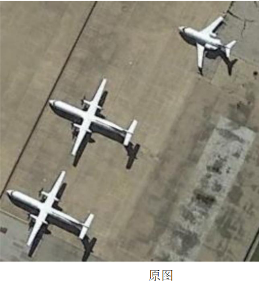
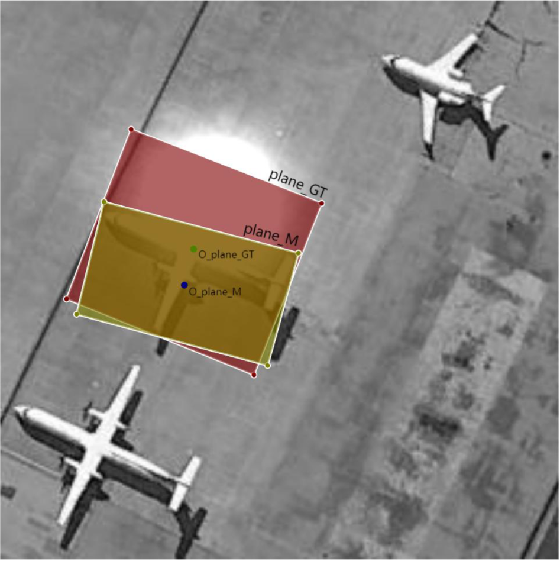

## 一、课程设计概述

### 1.1 课程目的

《模式识别与机器学习》课程设计作为独立的教学环节，是模式识别与智能系统专业集中实践性环节系列之一，是学习完《模式识别》、《模式识别与机器学习》课程后进行的一次全面的综合练习。其目的在于加深对模式识别与机器学习基础理论和基本知识的理解，掌握使用特征分析、特征提取及模式辨识的基本方法，提高解决实际问题、开发图像自动识别系统的实践能力。同时课程设计应充分体现"教师指导下的以学生为中心"的教学模式，以学生为认知主体，充分调动学生的积极性和能动性，重视学生自学能力的培养。

### 1.2 总体设计要求

模式识别课程设计由于涉及到的内容较多，工作量大，根据课程本身的特点，特提出如下要求：

1.  课程设计需要在课程内容讲完后给学生布置，让学生结合课堂讲授内容，并在教师的具体指导下，逐步开始分析工作。
2.  学生开展课程设计按 5 人一组进行分组，并确定一个组长，明确组员分工与协调。
3.  各组在分工的前提下制定相应的任务完成计划，并按计划开展课程设计，接受教师检查。
4.  课程设计的题目的选择可根据学生的自身理论学习体会和研究兴趣，结合实际或熟悉的课题，体现"麻雀虽小、五脏俱全"，充分练习模式识别的各个方面的内容。
5.  课程设计必须完成对模式识别与机器学习处理系统的分析与设计任务，编写相应的分析与设计报告。实施部分的内容可根据小组的实际能力决定取舍。

### 1.3 课程具体步骤与时间安排

本课程设计历时 10 周，学分 2 分。

具体步骤安排如下：

1.  课题选取，选取 1 个题目，并进行系统调研、资料整理。
2.  收集、整理、学习与设计相关的技术资料。
3.  进行相关选题的特征分析/模式分析，研究并设计实现任务的算法。可以参考复现文献中别人的研究成果，如能提出自己的见解和改进则更好。
4.  算法程序的设计和调试。
5.  按照进度对数据库数据进行实验，认真进行设计相关内容的记录,试验结果分析。试验结果如不能满足课题要求,需进行试验设计调整或算法调整,再次试验,直至试验结果满足课题要求,或进行不同算法试验结果比对与分析。
6.  完成课程设计报告。这是出成果的阶段，要认真整理前面各阶段的成果，包括完整的研究过程，实验中的失败与经验教训等，可以一一誊写在设计报告中。报告要求文字通顺、计算准确、画图清晰整洁。注意按统一规定格式和封面，打印、装订成册。工作量大、时间紧，需要付出一定的辛苦。

时间安排及方式(每 5 人一组)：

1.  课程设计任务书的布置，讲解（0.5 天）
2.  学生根据任务书的要求初步进行需求分析（第 7-8 周）
3.  进行方案设计，并撰写设计方案（第 9-10 周）
4.  指导老师审阅方案设计报告，根据意见修改设计方案（第 11 周）
5.  算法设计与实现（第 12-13 周）
6.  软件实现与算法测试（第 14-15 周）
7.  撰写课程设计报告（第 16 周）
8.  考核答辩（第 17 周）

## 二、课程设计项目：遮挡条件下遥感图像中的飞机目标检测

### 2.1 项目选题

我们的题目：遮挡条件下遥感图像中的飞机目标检测

### 2.2 任务描述

用高斯光斑模拟遥感图像中的飞机目标的部分遮挡场景，构建遮挡场景测试数据集，完成遮挡条件下遥感图像中飞机目标的自动检测，并给出目标中心（以原始无遮挡数据集中目标斜框中心为参考标注）。分析遮挡程度（可自行设计遮挡尺度指标）、目标尺度等因素对目标检测结果的影响。

自动检测，标记出其具体区域。注意检测结果采用倾斜目标范围框(回归)的方法，如下图所示。

原图

遮挡 1

检测结果

遮挡条件下飞机目标检测结果示意图

### 2.3 数据说明

无遮挡原始数据集采用 DOTA 数据集，选取其中飞机目标进行实验，数据集下载地址：[http://captain.whu.edu.cn/DOTAweb/](http://captain.whu.edu.cn/DOTAweb/)。

### 2.4 参考文献

[1] You Only Look Twice — Multi-Scale Object Detection in Satellite Imagery With Convolutional Neural Networks (Part I), Adam Van Etten, 2017.
[2] Lin Na, Feng Lirong, Zhang Xiaoqing. Aircraft Detection in Remote Sensing Image based on Optimized Faster-RCNN. Remote Sensing Technology and Application [J], 2021, 36(2): 275-284 doi:10.11873/j.issn.1004-0323.2021.2.0275
[3] Gui-Song Xia, Xiang Bai, Jian Ding, Zhen Zhu, Serge Belongie, Jiebo Luo, Mihai Datcu, Marcello Pelillo, and Liangpei Zhang. Dota: A largescale dataset for object detection in aerial images. In Proceedings of the IEEE conference on computer vision and pattern recognition, pages 3974–3983, 2018

### 2.5 指导老师

胡静, by6040130@163.com，qq：413953381

## 三、课程设计的考查

### 3.1 考核方式

由平时检查和结题答辩时的提问抽查、现场演示、课题难易程度和工作量饱满程度，以及设计报告撰写情况等几方面综合起来考虑。具体包括学习与设计态度的认真性，课堂知识理解掌握的深入程度，常用工具软件应用的熟练程度，设计方案的正确性或合理性，图文的质量效果，是否独立完成，是否具有独立分析解决问题的能力和创新精神等。

### 3.2 成绩评定

课程设计成绩的评价依据 = 工作量（15%）+个人工作表现（10%）+创新性（20%）+实验与分析（35%）+报告写作（10%）+报告答辩及成果展示（10%）。

| 评分内容     | 综合表现     | 设计报告     | 答辩         |
| ------------ | ------------ | ------------ | ------------ |
|              | 工作量       | 个人工作表现 | 创新性       |
|              | 实验与分析   | 报告写作     | 报告答辩及成果展示 |
| **评价比重** | **0.15**     | **0.10**     | **0.20**     |
|              | **0.35**     | **0.10**     | **0.10**     |

\*切记要独立完成，不得抄袭他人成果。一旦发现抄袭者，课程成绩一律按不及格处理。

课程设计成绩：按答辩时的评审老师评分平均值计算，采用百分制评定。95-100 为优秀，90-94 为良好，70-89 为中等，60-69 为及格，低于 60 分的为不及格。

-   **优秀**：能独立完成设计要求所规定的全部内容，设计方案正确、基本概念清楚，有独到的见解或创造性，与当前主流研究成果相比较效果更优异。每个组员的工作量饱满，贡献突出。
-   **良好**：能较好完成设计要求所规定的全部内容，设计方案正确，分析问题正确、基本概念清楚，运用多种当前主流技术和算法进行了任务实验、性能对比和深入分析。
-   **中等**：能完成设计要求规定的全部内容，设计方案基本正确，基本概念清楚。
-   **及格**：基本完成设计要求规定的内容，设计方案基本合理，基本概念较清楚。
-   **不及格**：未完成设计要求规定的内容，设计方案不合理，或有较严重缺陷，基本概念不清楚。

## 四、课程设计报告撰写要求

课程设计说明书是课程设计工作的总结，它应该反映出学生在课程设计过程中所做的主要工作和取得的主要成果。学生必须以积极认真、严谨求实的态度完成课程设计说明书的撰写。

课程设计说明书写作的具体内容包括：

### 4.1 封面

包括题目，指导老师，组员信息（姓名，学号，班级，每个人的工作占比）

### 4.2 摘要

要求写出同一内容的中文和英文的摘要。摘要应说明本设计的中心思想和主要内容，突出设计中的新见解新方法，说明该设计方案的理论根据及现实意义。摘要力求简明扼要，字数为 300 字左右。

### 4.3 目录

目录是整个设计的提纲，也是设计的重要组成部分，它方便评阅教师了解设计的整体结构。目录以章、节两级目录为宜。

### 4.4 正文

课程设计说明书的正文一般可按章、节的格式来书写，正文常常包括如下几个部分：

1.  **第一章 课题概述**
简要介绍所选课题现行研究现状、存在的主要问题，说明选题的意义及必要性。
2.  **第二章 算法分析**
    *   2.1 需求分析
    *   2.2 研究方案设计
    *   2.3 试验算法选择与分析（或算法设计）
    *   2.4 特征提取算法研究（可选）
    *   2.5 特征分析算法研究（可选）
    *   2.6 模式分类/识别算法研究（可选）
3.  **第三章 试验系统设计** (包含程序流程图、程序功能介绍)
    *   3.1 系统总体结构设计
    *   3.2 代码设计
    *   3.3 输入/输出设计
    *   3.4 模块功能与处理过程设计
4.  **第四章 软件实施与实验运行**
    *   4.1 软件系统实施（编程、调试、运行）
    *   4.2 数据库测试
    *   4.3 试验结果与分析
5.  **第五章 结束语**
研究结论,通过课程设计对模式识别学科的认识与体会,每人的工作划分。

### 4.5 附录

主要模块代码（注释代码比例不得低于 1：1）

### 4.6 参考文献

（不少于 6 篇）

以上内容供学生编写设计说明书时参考，学生可根据实际系统开发情况及指导教师的具体要求进行内容的增删或章节的调整。

## 五、答辩评分表（2025 版）

**华中科技大学《模式识别与机器学习课程设计》**

学生姓名： _________ 学号： _________ 工作占比： _________ 时间： _________

选题：（指导书序号+题名）__________________________________________

| 评价指标       | 评价要素                                                                                              | 分项评价（请打"√"）             |
| -------------- | ----------------------------------------------------------------------------------------------------- | -------------------------------- |
|                |                                                                                                       | 优     | 良     | 一般   | 较差   |
| 工作量         | 工作量饱满。                                                                                            |        |        |        |        |
| 个人工作表现   | 完成主要设计内容，设计工作参与度高，对小组集体工作贡献大。                                                |        |        |        |        |
| 创新性         | 研究成果有独到的见解和创新性。                                                                          |        |        |        |        |
| 实验与分析     | 实验充分；选择比对算法和方法充分考虑了国内外最新研究成果；实验结果真实可行；性能有相对性提高。            |        |        |        |        |
| 报告写作       | 概念正确，条理清晰，文笔流畅，格式规范，学风严谨；表达准确，语句通顺，语法正确。                            |        |        |        |        |
| 报告答辩       | 能流利、清晰地汇报设计报告的主要内容；能准确回答问题。                                                      |        |        |        |        |
| 成果展示       | PPT 制作美观大方，逻辑清晰，思路明确；答辩时成果展示充分，结果真实可信。                                    |        |        |        |        |
| **总体评价**   | 请在右侧栏内给出百分制总评成绩（100-90 为优秀；89-80 为良好；79-60 为一般；60 分以下不合格）               |                                  |
| 评审老师签名   |                                                                                                       |                                  |

 